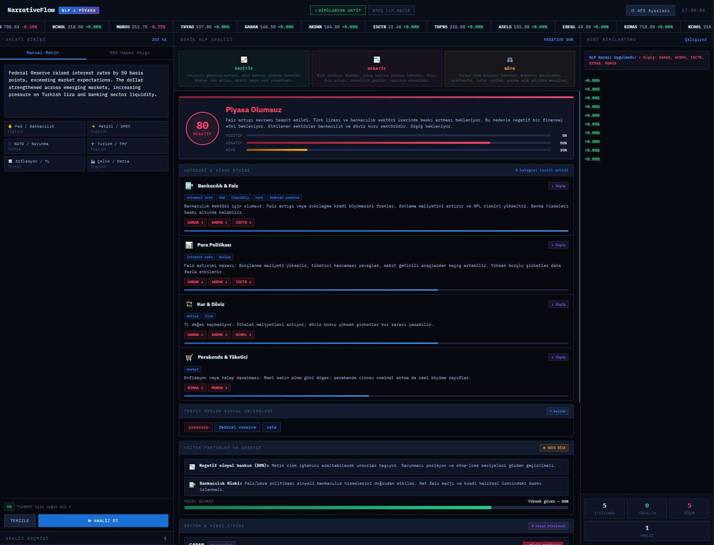
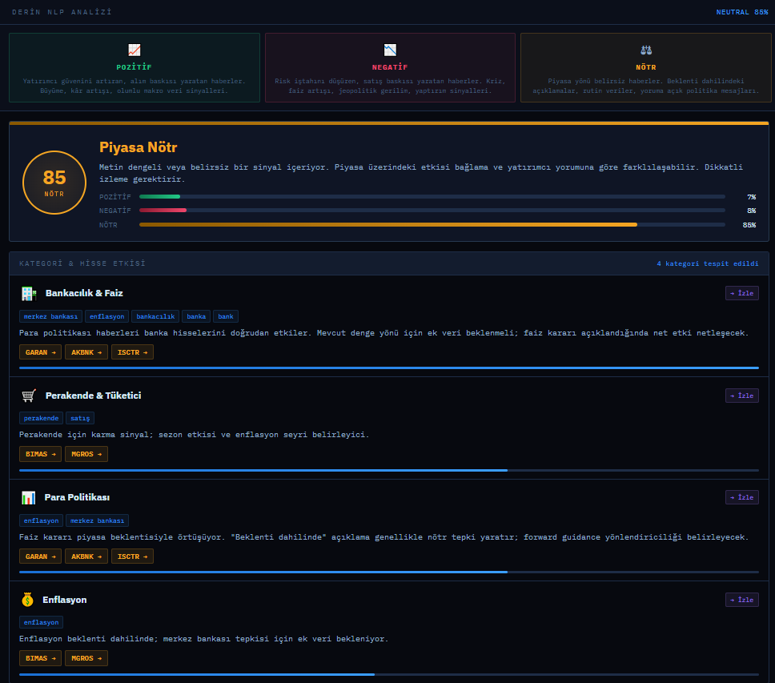
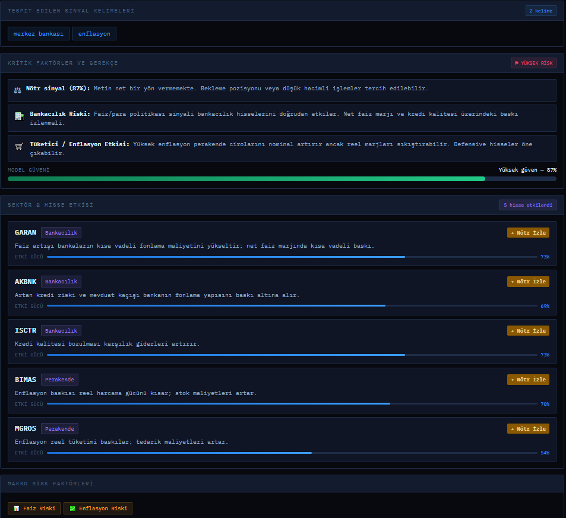
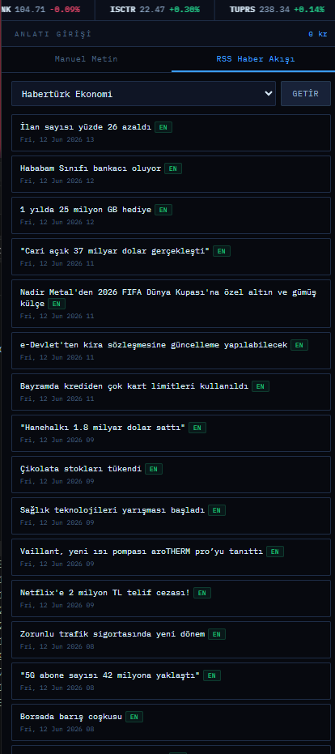
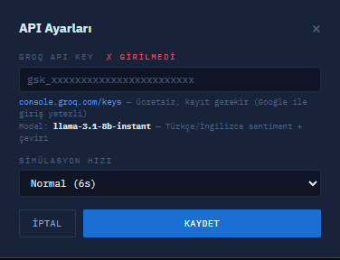

# NarrativeFlow

Finansal anlatıların yapay zekâ tabanlı sentiment analizi ile değerlendirilmesini ve elde edilen sonuçların Borsa İstanbul hisse senetleri üzerindeki etkilerinin dinamik olarak simüle edilmesini sağlayan web tabanlı bir projedir.

## Projenin Amacı

Bu proje; makroekonomik haberleri, merkez bankası kararlarını, jeopolitik gelişmeleri ve finansal anlatıları analiz ederek pozitif, negatif ve nötr duygu skorları üretir.

Elde edilen analiz sonuçları, Borsa İstanbul'da işlem gören seçili şirketlerin hisse senedi fiyatlarına dinamik olarak yansıtılır.

## Temel Özellikler

- Manuel finansal metin girişi
- RSS kaynaklarından finans haberlerinin alınması
- Türkçe ve İngilizce dil tespiti
- Yapay zekâ tabanlı sentiment analizi
- Kural tabanlı finansal sözlük desteği
- Pozitif, negatif ve nötr duygu skorlarının hesaplanması
- Sektör ve şirket eşleştirmesi
- Dinamik hisse senedi fiyat simülasyonu
- Canlı ticker bandı
- Hisse bazlı kıvılcım grafikleri
- Etkilenen şirket ve sektörlerin gösterilmesi
- Gerçek zamanlı simülasyon istatistikleri

## Kullanılan Teknolojiler

- HTML5
- CSS3
- JavaScript
- Chart.js
- Groq API
- Llama 3.1
- RSS
- XML
- JSON
- DOMParser

## Analiz Yapısı

Sistem iki farklı analiz yöntemi kullanır:

### Yapay Zekâ Tabanlı Analiz

Finansal metinler yapay zekâ modeliyle analiz edilir. Analiz sonucunda pozitif, negatif ve nötr duygu skorları oluşturulur.

### Kural Tabanlı Analiz

Yapay zekâ tabanlı analizin kullanılamadığı durumlarda finansal olumlu ve olumsuz kelimelerden oluşan sözlük yapısı devreye girer.

## Simülasyonda Kullanılan Hisseler

| Hisse | Şirket | Sektör |
|---|---|---|
| THYAO | Türk Hava Yolları | Havacılık |
| GARAN | Garanti BBVA | Bankacılık |
| AKBNK | Akbank | Bankacılık |
| ISCTR | Türkiye İş Bankası | Bankacılık |
| TUPRS | Tüpraş | Enerji |
| ASELS | Aselsan | Savunma ve Teknoloji |
| EREGL | Ereğli Demir Çelik | Demir-Çelik |
| BIMAS | BİM Mağazaları | Perakende |
| MGROS | Migros | Perakende |
| KCHOL | Koç Holding | Holding |

## Fiyat Simülasyonu

Hisse senedi fiyatları, piyasa oynaklığı ve sentiment analizinden elde edilen yön bilgisine göre güncellenir.

```text
P_t = P_(t-1) × (1 + Drift_total)
```

Toplam fiyat hareketi:

```text
Drift_total = Drift_random + Drift_NLP
```

Yapay zekâ analizinden gelen yön bilgisi:

- Pozitif haber: `+1`
- Negatif haber: `-1`
- Nötr haber: `0`

## Proje Görselleri

### Ana Ekran



### Analiz Sonucu



### Tahmin Ekranı



### Haber Ekranı




### Haber Ekranı



## Projeyi Çalıştırma

1. Projeyi bilgisayarınıza indirin.
2. `borsa.html` dosyasını açın.
3. Uygulamayı tarayıcı üzerinden kullanın.

## Hazırlayan

**Nurgül Yılmaz**
